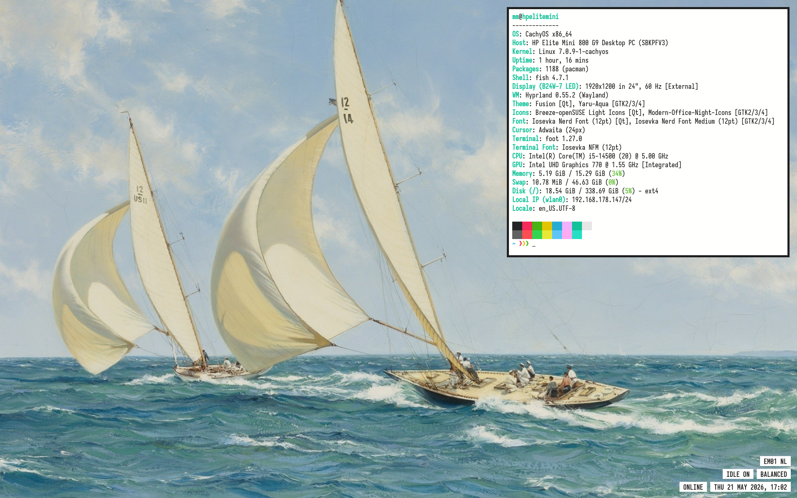

# Ciao!

Here's all my dotfiles. A README with some general instructions is included in every directories. Have fun with Linux!

## Hyprland - HP Elite Mini
[Go to files](Hyprland-Elite-Mini)

## LabWC - 1920x1200
[Go to files](LabWC-1920x1200)

## LabWC - Lenovo H50
[Go to files](LabWC-1280x1024-H50)

## LabWC - ASUS Chromebook Plus
[Go to files](LabWC-Chromebook-Plus)

## LabWC - Raspberry Pi 500
[Go to files](LabWC-Alpine-Raspberry-Pi-500)

## LabWC - Chromebook
[Go to files](LabWC-Alpine-Chromebook)

## LabWC - Netbook
[Go to files](LabWC-Alpine-Netbook)

## LabWC - ThinkPad X230
[Go to files](LabWC-Alpine-ThinkPad-X230)

## Hyprland - Surface Laptop 3
[Go to files](Hyprland-Surface-Laptop-3)

## Hyprland - Desktop Workstation
[Go to files](Hyprland-Desktop-Viola-Blu)

## Hyprland - MacBook Pro 13 Intel
[Go to files](Hyprland-MacBook-Pro-13-Intel)

## Hyprland - MacBook Pro 15 2013
[Go to files](Hyprland-MacBook-Pro-15)

## Hyprland - Mini PC
[Go to files](Hyprland-Mini-PC)

## Hyprland - Samsung Galaxy Book 2 OLED
[Go to files](Hyprland-Samsung-Galaxy-Book-2-OLED)

## Hyprland - Surface Laptop Go
[Go to files](Hyprland-Surface-Laptop-Go)

## Hyprland - ThinkPad X1 OLED
[Go to files](Hyprland-ThinkPad-X1-OLED)

## Hyprland - ZenBook Duo Clone Dual Screen
[Go to files](Hyprland-ZenBook-Duo-Clone-Dual-Screen)

## Herbstluft - KDE Desktop Workstation
[Go to files](Herbstluft-KDE-Desktop)

## Herbstluft - Raspberry Pi 400
[Go to files](Herbstluft-Raspberry-Pi-400)

## i3 - Chuwi Larkbook X
[Go to files](i3-Chuwi-Larkbook-X)

## i3 - HP Chromebook 13
[Go to files](i3-HP-Chromebook-13)

## i3 - HP Mini 5101
[Go to files](i3-HP-Mini-5101)

## i3 - HP Mini 5103
[Go to files](i3-HP-Mini-5103)

## i3 - Raspberry OS Cyberdeck
[Go to files](i3-Raspberry-OS-Cyberdeck)

## i3 - ThinkPad X1 G3
[Go to files](i3-ThinkPad-X1-G3)

## i3 - Pixelbook Linux
[Go to files](i3-Pixelbook)

## Sway - Dell XPS 13
[Go to files](Sway-Dell-XPS-13)

